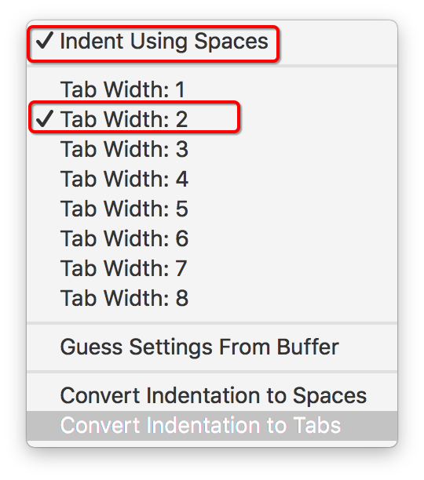
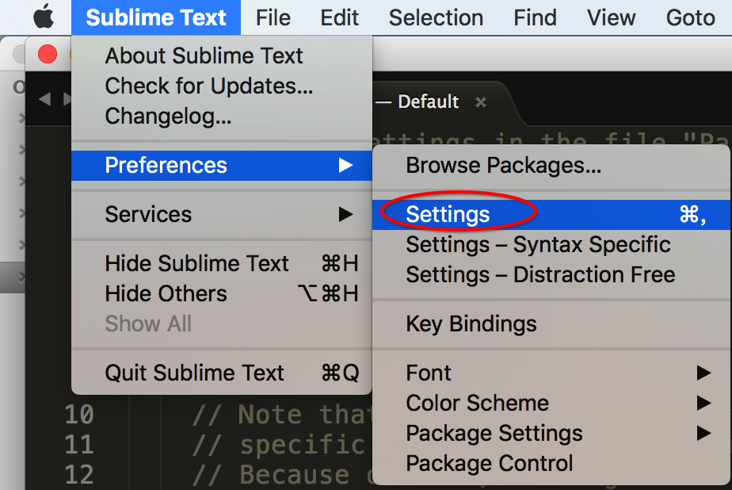

# 在 node.js 上编写程序


## REPL介绍
1. REPL 全称: Read-Eval-Print-Loop（交互式解释器）
  - R 读取 - 读取用户输入，解析输入了Javascript 数据结构并存储在内存中。
  - E 执行 - 执行输入的数据结构
  - P 打印 - 输出结果
  - L 循环 - 循环操作以上步骤直到用户两次按下 ctrl-c 按钮退出。

2. 在REPL中编写程序 （类似于浏览器开发人员工具中的控制台功能）
  + 直接在控制台输入 `node` 命令进入 REPL 环境

3. 按两次 Control + C 退出REPL界面 或者 输入 `.exit` 退出 REPL 界面
  + 按住 control 键不要放开, 然后按两下 c 键


## 创建 JavaScript 文件编写程序

### 编程注意事项
  + 配置一下Sublime Text 的代码缩进格式为2个空格
  + 方式一

  
  + 方式二

  

  


### JavaScript 文件名命名规则
  + 不要用中文
  + 不要包含空格
  + 不要出现node关键字
  + 建议以 '-' 分割单词


### 案例

1. 案例1：编写一个简单的函数, 实现数字相加

```javascript
var n = 10;
var m = 100;

function add(x, y) {
  return x + y;
}

var result = add(m, n);

console.log('计算结果是：' + result);
```


2. 案例2：编写一个输出'三角形'的程序

```javascript

// process 对象是一个 global （全局变量），提供有关信息，控制当前 Node.js 进程。
// 作为一个对象，它对于 Node.js 应用程序始终是可用的，故无需使用 require()。

for (var i = 0; i < 10; i++) {
  for (var j = 0; j <= i; j++) {
    // 注意：console.log()输出完毕后是带换行的，所以这样做不可以
    // console.log('*');
    process.stdout.write('* ');
  }
  process.stdout.write('\n');
}
```


3. 案例3：文件读写案例（带同学们打开官方文档查阅）
  - 使用到的模块`var fs = require('fs');`
  
  - 1、写文件：`fs.writeFile(file, data[, options], callback);`
    + 参数1：要写入的文件路径，**必填**。
    + 参数2：要写入的数据，**必填**。
    + 参数3：写入文件时的选项，比如：文件编码，选填。
    + 参数4：文件写入完毕后的回调函数，**必填**。
    + 写文件注意：
      * 该操作采用异步执行
      * 如果文件已经存在则替换掉
      * 默认写入的文件编码为utf8
      * 回调函数有1个参数：err，表示在写入文件的操作过程中是否出错了。
        - 如果出错了`err != null`，否则 `err === null`
  
  - 2、读文件：`fs.readFile(file[, options], callback)`
    + 参数1：要读取的文件路径，**必填**。
    + 参数2：读取文件时的选项，比如：文件编码。选填。
    + 参数3：文件读取完毕后的回调函数，**必填**。
    + 读文件注意：
      - 该操作采用异步执行
      - 回调函数有两个参数，分别是err和data
      - 如果读取文件时没有指定编码，那么返回的将是原生的二进制数据；如果指定了编码，那么会根据指定的编码返回对应的字符串数据。
  - 注意：
    +  文件操作中的`./`表示当前路径，相对的是执行node命令的路径，而不是当前被执行的`*.js`文件的实际路径。
    +  `__dirname`才永远表示当前被执行的`*.js`文件的实际路径
    +  `/`表示根目录, 读取文件或写入文件的时候写`/`目录，在Windows下相当于当前磁盘根目录（比如：c:\ 或 d:\ 或 e:\  等，在Mac下相当于硬盘根目录 `/`）
  
```javascript
// --------------------------------- 写文件 -----------------------------
// 加载文件操作模块
var fs = require('fs');

// 创建要写入的文件的字符串
var msg = '你好，世界！你好 Node.js.';
// 执行文件写入操作
fs.writeFile('./data.txt', msg, 'utf8', function (err) {
  console.log('---' + err + '----');
  // /判断是否写入文件出错了
  if (err) {
    console.log('文件写入出错了，详细错误信息：' + err);
    // 把错误继续向上抛出
    throw err;
  } else {
    console.log('文件写入成功！');
  }
});


// --------------------------------- 读文件 -----------------------------
// 加载文件操作模块
var fs = require('fs');

// 执行文件读取操作
fs.readFile('./data.txt', 'utf8', function (err, data) {
  // 输出err  和 data
  // console.log('error: ' + err);
  // console.log('data: ' + data);

  if (err) {
    console.log('文件读取出错啦！详细信息: ' + err);
  } else {
    console.log('文件读取成功，以下是文件内容：');
    console.log(data);
  }
});
```


4. 案例4：创建目录案例

```javascript
// 创建一个文件夹


// 加载文件操作模块
var fs = require('fs');

// 创建一个目录
fs.mkdir('./test-mkdir', function (err) {
  if (err) {
    console.log('创建目录出错了，详细信息如下：');
    console.log(err);
  } else {
    console.log('目录创建成功！');
  }

});


// ----------------------------------------------------------

// 加载文件操作模块
var fs = require('fs');

// 1. 创建 '01-教学资料' 目录
fs.mkdir('./01-教学资料', function (err) {

  if (err) {
    throw err;
  }

  // 1.1 创建 '01-笔记大纲' 目录
  fs.mkdir('./01-教学资料/01-笔记大纲');

  // 1.2 创建 '02-作业任务' 目录
  fs.mkdir('./01-教学资料/02-作业任务');

  // 1.3 创建 '03-素材资料' 目录
  fs.mkdir('./01-教学资料/03-素材资料');

  // 1.4 创建 '04-随堂笔记' 目录
  fs.mkdir('./01-教学资料/04-随堂笔记');

});


// 2. 创建 '02-源代码' 目录
fs.mkdir('./02-源代码', function (err) {

  if (err) {
    throw err;
  }

  // 2.1 创建 '预习代码'目录
  fs.mkdir('./02-源代码/预习代码');

  // 2.2 创建 '课堂代码'目录
  fs.mkdir('./02-源代码/课堂代码');
});


// 3. 创建 '03-视频' 目录
fs.mkdir('./03-视频');


// 4. 创建 '04-其他资料' 目录
fs.mkdir('./04-其他资料');

```


### 注意：
1. 异步操作无法通过 try-catch 来捕获异常，要通过判断 error 来判断是否出错。
2. 同步操作可以通过 try-catch 来捕获异常。
3. 不要使用 `fs.exists(path, callback)` 来判断文件是否存在，直接判断 error 即可
4. 文件操作时的路径问题
  - 在读写文件的时候 './' 表示的是当前执行node命令的那个路径，不是被执行的js文件的路径
  - __dirname, 表示的永远是"当前被执行的js的目录"
  - __filename, 表示的是"被执行的js的文件名（含路径)"
5. error-first 介绍(错误优先)


### 案例5：通过 node.js 编写 http 服务程序 - 极简版本

步骤：
1. 加载http模块
2. 创建http服务
3. 为http服务对象添加 request 事件处理程序
4. 开启http服务监听，准备接收客户端请求


注意：
1. 浏览器显示可能是乱码，所以可以通过 `res.setHeader('Content-Type', 'text/plain; charset=utf-8');`设置浏览器显示时所使用的编码。

2. Chrome 浏览器默认无法手动设置编码，需要安装"Set Character Encoding"扩展。

3. 演示一下设置`Content-Type=text/html` 和 `Content-Type=text/plain`的区别。


参考代码：

```javascript

// 1. 加载http模块
var http = require('http');

// 2. 创建http服务
var server = http.createServer();

// 3. 开始监听'request'事件
// 详细解释一下request对象和response对象
server.on('request', function (req, res) {
  // body...
  console.log('有人请求了~~');
});

// 4. 启动服务，开始监听
server.listen(9000, function () {
  console.log('服务已经启动，请访问： http://localhost:9000');
});

```


### 案例6：通过 node.js 编写 http 服务程序 - 根据不同请求作出不同响应

#### 说明：
- 根据不同请求，显示index页面、login页面、register页面、list页面。
- 请求 / 或 /index
- 请求 /login
- 请求 /register
- 请求 /list


#### 参考代码

```javascript
// 加载http模块
var http = require('http');

// 创建http server
var server = http.createServer(function (req, res) {
  // body...
  console.log(req.url);


  if (req.url === '/' || req.url === '/index') {
    // 表示请求网站首页
    res.end('这是 index.html');

  } else if (req.url === '/login') {
    // 表示请求登录页面
    res.end('这是 login.html');

  } else if (req.url === '/register') {
    // 表示请求注册页面
    res.end('这是 register.html');
    
  } else if (req.url === '/list') {
    // 表示请求列表页面
    res.end('这是 list.html');
    
  } else {
    // 表示请求的页面不存在
    res.writeHead(404, 'Not Found');
    res.end('Sorry, page not found.');
  }
});

// 监听端口的网络请求
server.listen(9000, function () {
  console.log('http://localhost:9000');
});

```


### 案例7：通过 node.js 编写 http 服务程序 - 通过读取静态 HTML 文件来响应用户请求

步骤：
1. 创建index.html、login.html、register.html、list.html、404.html文件。 
2. 演示通过读取最简单的 HTML 文件来响应用户。
3. 演示通过读取"具有引入外部CSS样式表"的HTML文件来响应用户。
4. 演示通过读取"具有img标签"的HTML文件来响应用户。


注意：
- 1、注意在发送不同类型的文件时，要设置好对应的`Content-Type`
  + [Content-Type参考 OSChina](http://tool.oschina.net/commons)
  + [Content-Type参考 MDN](https://developer.mozilla.org/en-US/docs/Web/HTTP/Basics_of_HTTP/MIME_types)

- 2、HTTP状态码参考
  + [w3org参考](https://www.w3.org/Protocols/rfc2616/rfc2616-sec10.html)
  + [w3schools参考](https://www.w3schools.com/tags/ref_httpmessages.asp)

- 3、在html页面中写相对路径'./' 和 绝对路径 '/'的含义 。
  + 网页中的这个路径主要是告诉浏览器向哪个地址发起请求用的
  + './' 表示本次请求从相对于当前页面的请求路径（即服务器返回当前页面时的请求路径）开始
  + '/' 表示请求从根目录开始

补充知识点：
1. path 模块的 join() 方法


参考代码：

```javascript

// 1. 加载 http 模块
var http = require('http');
// 加载文件操作模块
var fs = require('fs');
// 加载path模块，这个模块主要用来处理各种路径。
var path = require('path');


// 2. 创建http server
var server = http.createServer(function (req, res) {
  // 1. 获取用户请求的URL
  var url = req.url.toLowerCase();

  // 2. 根据用户的不同请求，做出不同响应
  if (url === '/' || url === '/index') {
    // 读取index.html文件，把该文件响应给用户
    fs.readFile(path.join(__dirname, 'index.html'), function (err, data) {
      if (err) {
        throw err;
      }
      res.writeHead(200, 'OK', {
        'Content-Type': 'text/html; charset=utf-8'
      });
      // res.setHeader('Content-Type', 'text/html; charset=utf-8');
      res.end(data);

    });
  } else if (url === '/login') {
    // 读取login.html文件，把该文件响应给用户
    fs.readFile(path.join(__dirname, 'login.html'), function (err, data) {
      if (err) {
        throw err;
      }
      res.writeHead(200, 'OK', {
        'Content-Type': 'text/html; charset=utf-8'
      });
      // res.setHeader('Content-Type', 'text/html; charset=utf-8');
      res.end(data);

    });
  } else if (url === '/register') {
    // 读取register.html文件，把该文件响应给用户
    fs.readFile(path.join(__dirname, 'register.html'), function (err, data) {
      if (err) {
        throw err;
      }
      res.writeHead(200, 'OK', {
        'Content-Type': 'text/html; charset=utf-8'
      });
      // res.setHeader('Content-Type', 'text/html; charset=utf-8');
      res.end(data);

    });
  } else if (url === '/404') {
    // 读取register.html文件，把该文件响应给用户
    fs.readFile(path.join(__dirname, '404.html'), function (err, data) {
      if (err) {
        throw err;
      }
      res.writeHead(200, 'OK', {
        'Content-Type': 'text/html; charset=utf-8'
      });
      // res.setHeader('Content-Type', 'text/html; charset=utf-8');
      res.end(data);

    });
  }
  
});


// 3. 启动服务
server.listen(9090, function () {
  // body...
  console.log('please visit: http://localhost:9090');
});


```


### 案例8：模拟 Apache 实现静态资源服务器

步骤：
- 单独创建一个目录来实现，比如：创建一个"07-Apache"的目录。
- 在该目录下新建 `public` 目录，假设该目录为静态资源目录。
- 根据用户请求的路径在 public 目录下寻找对应路径下的资源。
- 如果找到了，那么将该资源返回给用户，如果没找到则返回404错误。
- 通过 mime 模块设置不同类型资源的Content-Type
- 实现完毕后把素材中的'An Ocean of Sky' 和 'Hacker News'分别拷贝到静态资源目录下, 测试是否成功

其他：
- 介绍 NPM
- 介绍 mime 第三方模块
  + `npm install mime`
  + 在代码中直接 `var mime = require('mime')`


参考代码：

```javascript

// 1. 加载对应模块
// 1.1 加载http模块
var http = require('http');
// 1.2 加载path模块，方便路径拼接
var path = require('path');
// 1.3 加载文件读取模块
var fs = require('fs');
// 1.4 加载判断文件MIME类型的模块
var mime = require('mime');


// 2. 创建http server
var server = http.createServer();


// 3. 监听用户request事件
server.on('request', function (req, res) {
  // 1. 获取用户的请求路径, 并转换为小写
  var url = req.url.toLowerCase();

  // 判断如果请求的路径是 '/' 那么等价于 '/index.html'
  url = (url === '/') ? '/index.html' : url;

  // 2. 根据用户请求的url路径, 去public目录下查找对应的静态资源文件。找到后读取该文件，并将结果返回给用户
  // 2.1 根据用户请求的url拼接本地资源文件的路径
  var filePath = path.join(__dirname, 'public', url);

  // 2.2 根据请求的文件路径设置Content-Type
  res.setHeader('Content-Type', mime.lookup(url));

  // 2.2 根据路径去读取对应的文件
  // 【注意】读取文件前无需判断文件是否已经存在，而是在读取文件的回调函数中根据error的错误信息来判断读取文件是否成功以及发生的错误
  fs.readFile(filePath, function (err, data) {
    // 判断是否有错误
    if (err) {

      if (err.code === 'ENOENT') { // 判断是否是请求的文件是否不存在

        res.setHeader('Content-Type', 'text/html; charset=utf8');
        res.statusCode = 404;
        res.statusMessage = 'Not Found';
        res.end('<h1>请求的资源不存在！</h1>');

      } else if (err.code === 'EACCES') { // 判断文件是否有访问权限

        res.setHeader('Content-Type', 'text/html; charset=utf8');
        res.statusCode = 403;
        res.statusMessage = 'Forbidden';
        res.end('<h1>Permission denied！</h1>');
      } else {

        throw err;  
      }

    } else {
      
      // 如果没有错误则将读取到的文件返回给用户
      res.statusCode = 200;
      res.statusMessage = 'OK';
      res.end(data);
    }
  })
});


// 4. 启动服务
server.listen(9000, function () {
  // body...
  console.log('server is running, please visit: http://localhost:9000');
});

```


## Common System Errors - 常见错误号

- EACCES (Permission denied)
  + An attempt was made to access a file in a way forbidden by its file access permissions.
  + 访问被拒绝

- EADDRINUSE (Address already in use)
  + An attempt to bind a server (net, http, or https) to a local address failed due to another server on the local system already occupying that address.
  + 地址正在被使用（比如：端口号备占用）

- EEXIST (File exists)
  + An existing file was the target of an operation that required that the target not exist.
  + 文件已经存在

- EISDIR (Is a directory)
  + An operation expected a file, but the given pathname was a directory.
  + 给定的路径是目录

- ENOENT (No such file or directory)
  + Commonly raised by fs operations to indicate that a component of the specified pathname does not exist -- no entity (file or directory) could be found by the given path.
  + 文件 或 目录不存在

- ENOTDIR (Not a directory)
  + A component of the given pathname existed, but was not a directory as expected. Commonly raised by fs.readdir.
  + 给定的路径不是目录


## 同步文件操作 和 异步文件操作

- `fs.readFile(file[, options], callback)`
- `fs.readFileSync(file[, options])`


## 通过设置 http 响应报文头实现弹框下载功能

1. 设置 `Content-Type: application/octet-stream`
2. 设置 `Content-Disposition: attachment; filename=demo.txt`


